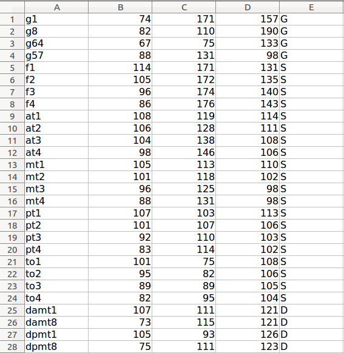

Electrode Localization Toolbox Manual

developed by Hugh Wang (Xiuyuan.Wang at nyumc.org), Department of Neurology, New York University School of Medicine

**Attention**:
>The Electrode Localization Toolbox was tested and only runs under 64bit Lunix or OSX (Thanks to David Groppe  for compiling the mex files under OSX 10.9.5 / 2015-6-3)
> 
>Preferred software version (or newer): Matlab R2013a, SPM12, FSL 5.0, and FREESURFER 5.3.0 
>
>Please add SPM and ntools_elec folder into Matlab path
>
>Please install FSL and FREESURFER properly

# Autocoregistration
Autocoregistration is a program that coregisters the post-implantation image with the pre-implantation image using fsl commands to coregister, match to standard MNI images, and skull strip. Input can be both .nii and .mgz files. It also using Freesurfer subject aseg file to remove the cerebellum so that it will give a clear view for the electrodes on inferior temporal lobe with 3D rendering in MRIcro.
 
Run ntools_elec_autocoreg In MATLAB command window. In the pop-ups:
>
>Select Freesurfer T1.mgz
>
>Select $SUBJECTS_DIR/subject/mri/T1.mgz
>
>Select $SUBJECTS_DIR/subject/mri/aseg.mgz (if available)
>
>Select elec_MRI_T1 image
>
>Select elec_MRI_T2 image (if available)

This program takes a few minutes. A elec_preop.nii.gz file should be written, as well as elec_preop.mat, elec_preop_brain.nii.gz, elec_preop_brain_cortex.nii.gz, T1.nii.gz.
 
# Electrode Localization
 
Electrode localization is composed of two parts: manual localization of some of the electrodes and automated projection of the rest of the electrodes.
 
## Manual localization
 

Initial electrodes voxel coordinates are given from Fsleyes in above example. Use the crosshair to find the center of the electrode (best approximation) and enter the coordinates found in red box in above picture into the electrodes coordinates text or excel file.

The idea here is to localize the following:
Depth electrodes: the first and last electrode
Strip electrodes: every electrode
Grid electrodes: any 2 or 3 electrodes in the grid. Usually aim for corner electrodes. 

**Notes**

1. If the edges of grid are clear on coregistered mri, it is always preferred to select all 4 corner electrodes in either clockwise or anticlockwise order. 

2. If you want to use 3 initial points for the grid, make sure these 3 points can shape a rectangular triangle, and the perpendicular foot has to be in the middle of the three.

3. If there are 2 grids labeled with the same letter, or one grid broken up into several parts, treat them as separate grids and label them differently, for example splitting GA1~64 as GA1~32 and GB1~32 (which is actually GA33~64), adjusting the numbering of the rest grids. After a final image is created, edit the output electrodes coordinates text file and manually adjust each electrode to its original label according to the sketch. 

An example of initial electrodes coordinates text:

 

 
In the 5th column of the initial text file, indicate what type of the electrode it is (G for grid, D for depth and S for strip).
 
 
## Automated Projection
Run ntools_elec in Matlab command window. In the pop-ups:

1. Select the subject's FREESURFERRECON folder

2. Select the ini.txt or xls(xlsx) file

 
3. choose the preop T1 image:

 
4. Select the hemisphere ( lh, rh, or both )
 
5. Input the inter-electrode distance (mm) (Press Enter for default distance 10mm)
 
6. Select the size of the grid

 
6.5.Verify the orientation of the initial grid points ( If you pick up 3 or 4 initial points for the grid, then this window won't pop up)

 
7. calculating the mean and standard deviation of distance between nearest two electrodes. If no result satisfies with the std smaller than 1 and mean distance is 10+-1, manually input the NO. of result you think is good enough or type number '0' to exit and recheck the initial text file.

 
8. viewing the results on the brain surface
 
## ntools_elec outputs

lh.aparc.a2009s.annot: Freesurfer subject Destrieux Atlas annotation in surface space

lh.aparc.split_STG_MTG.annot: Freesurfer subject Desikan Atlas with split (rostral, middle, caudal) superior/medial temporal gyri in surface space

[subj]\_coor\_MNI\_[date].txt: electrode coordinates in MNI volume and surface space

[subj]\_coor\_T1\_[date].txt: electrode coordinates in subject SURFACE space (not fit with T1.nii.gz)

[subj]\_elec\_bin\_T1\_[date].nii.gz: electrode image in subject preop T1 VOLUME space(not fit with *_pial_surf.mat), with intensity corresponding to the row number of coor_T1 text file, indicating the electrode labels. The coordinates of electrodes from elec_bin is usually different from the coor_T1 text file, but this difference is consistent across electrodes, which is the shift between volume space and surface space.

[subj]\_lh\_pial\_surf.mat: subject triangulated surface mat file

T1.nii.gz: subject preop T1 MPRAGE

# Misc Notes
 
## Useful programs for MRI visualization
MRICRCO (PC, Linux & MAC) starts with 'mricro' in Unix terminal http://www.sph.sc.edu/comd/rorden/mricro.html

MRICRON (PC, Linux & MAC) http://www.sph.sc.edu/comd/rorden/mricron

FSLVIEW (Linux & MAC) starts with 'fslview' in Unix terminal  http://www.fmrib.ox.ac.uk/fsl/fslview/index.html

3DSlicer (PC, Linux, MAC) starts with 'slicer' in Unix terminal (http://www.slicer.org/)

## Electrode Visualization
### ntools_elec_plot 
a stand-alone Matlab script for viewing the electrodes on brain surface. To do so:
In MATLAB: ntools_elec_plot
Select the subj_coor_*.txt file
Select the surface mat file
Select if (or not) to show the electrode labels and save into images
Choose to plot only the grid, strips, depth or both grid and stips.
Select if (or not) to plot with segmentation annotations (see below for plotting with annotation)

### ntools_elec_plotGroup
a stand-alone Matlab script for viewing certain electrodes on brain surface. It requires a different electrode coordinates text file: in the fifth column, instead of G/D/S, there are numbers e.g. 1~8, so you can choose to plot 2,4,5. Numbers can be any positive integers. Example text file shows below:

### ntools_elec_saveAnatomical

ntools_elec_saveAnatomical paints the electrodes onto subject’s pial surface and output the anatomical regions (in percentage) where each electrode locates. A full FREESURFER reconstruction is required for this feature. 

The input variable ‘hemi’ can only be ‘lh’ or ‘rh’ or ‘depth’. ‘lh’ and ‘rh’ will find the anatomical regions percentage for cortex electrodes (grids and strips), and ‘depth’ option will find the percentage for depth electrodes. The electrode coordinates text file from ntools_elec.m is combined left and right hemisphere, therefore a manual split into two separate text files is necessary. 

Usage: ntools_elec_saveAnatomical( subjID, hemi, elec_coor_text, elec_voxel_img)

e.g.: 	
  
  ntools_elec_saveAnatomrical(‘NY001’,’lh’,’NY001_lh_coor.txt’)
  
  ntools_elec_saveAnatomrical(‘NY001’,’rh’,’NY001_rh_coor.txt’)

  ntools_elec_saveAnatomrical(‘NY001’,’depth’,’NY001_lh_rh_coor.txt’,’NY001_elec_bin.nii’)

Output:

[subj]\_T1\_lh\_split\_STG\_MTG\_AnatomicalRegions.txt: anatomical percentage coverage of each electrode, using aparc.split_STG_MTG.annot
